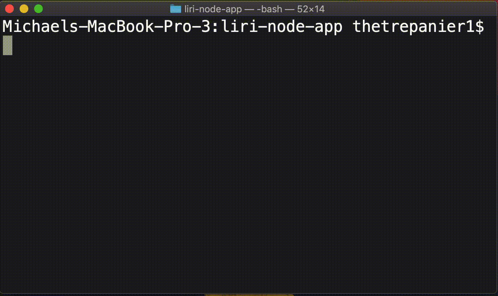
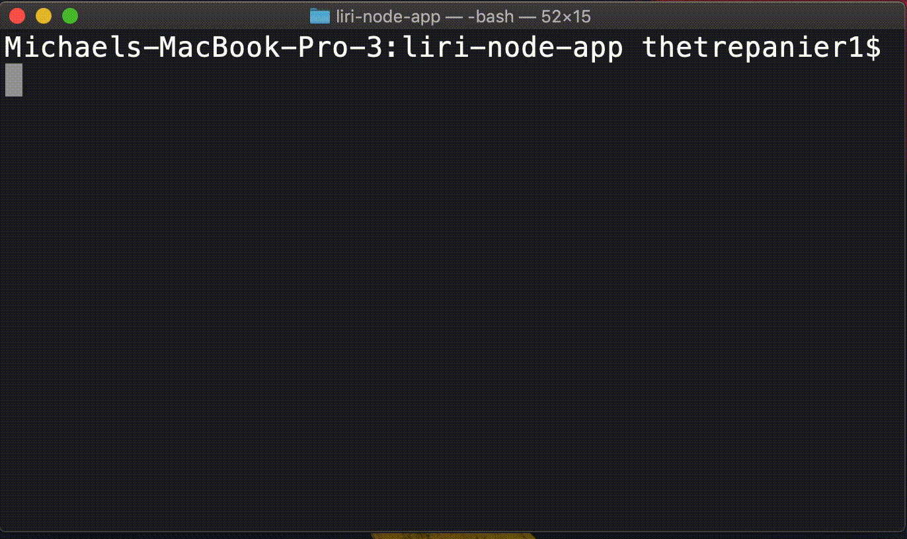
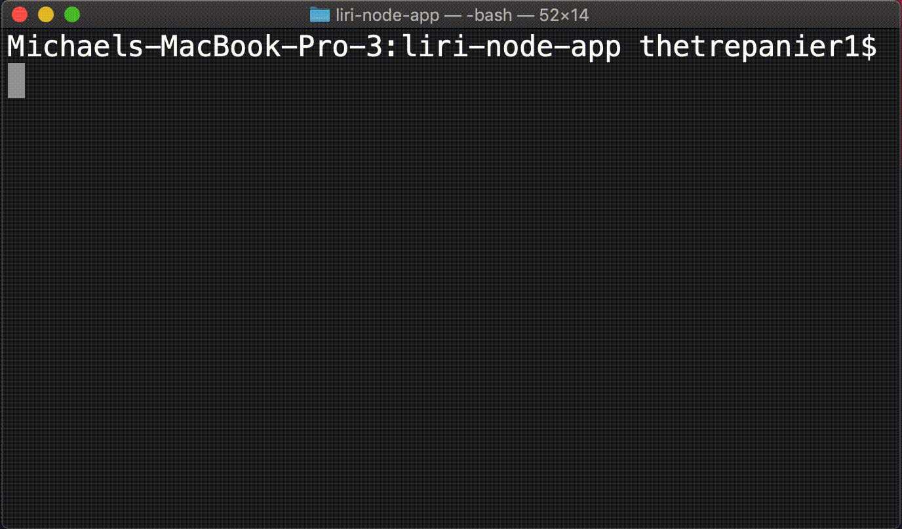

# LIRI Bot

### Overview

LIRI is a command line node app that takes in parameters and gives you back data.

## Example Functions

> NOTE: `string` may contain spaces in any of the following commands

### concert-this `string`

`concert-this` will query the [Bands In Town API](https://manager.bandsintown.com/support/bandsintown-api) and return the first five results. The number of results is currently hard coded.

---

### spotify-this-song `string`

`spotify-this-song` takes advantage of both the [node-spotify-package](https://www.npmjs.com/package/node-spotify-api) and the [Spotify API](https://developer.spotify.com/documentation/web-api/reference/) itself. The number of results is currently hard coded.

#### With a song provided

#### If there is no song given

liri.js will return a previously determined search for the song [Up We Go](https://open.spotify.com/track/7Hew8P4yKpYeuGmfS4OB4s?si=Z-zRncaoRkqaM9okzu4Vtw), by [Lights](https://open.spotify.com/artist/5pdyjBIaY5o1yOyexGIUc6?si=JHpN2fhgS0yw1hKTBhHPew)

---

### movie-this `string`

`movie-this` sends a query to [The Open Movie Database API](http://www.omdbapi.com/), returning a movie's, 
- Title
- Release date
- Director
- Ratings from 
  - IMDB
  - Rotten Tomateos
  - Metacritic
- Actors
- Production Language

#### With a movie searched

#### Without a movie searched

If no movie title is entered information for The Greatest Showman will display

---

### do-what-it-says

there are no arguments that can be passed into `do-what-it-says`. When called liri.js will act on a previously created command that is stored in random.txt

